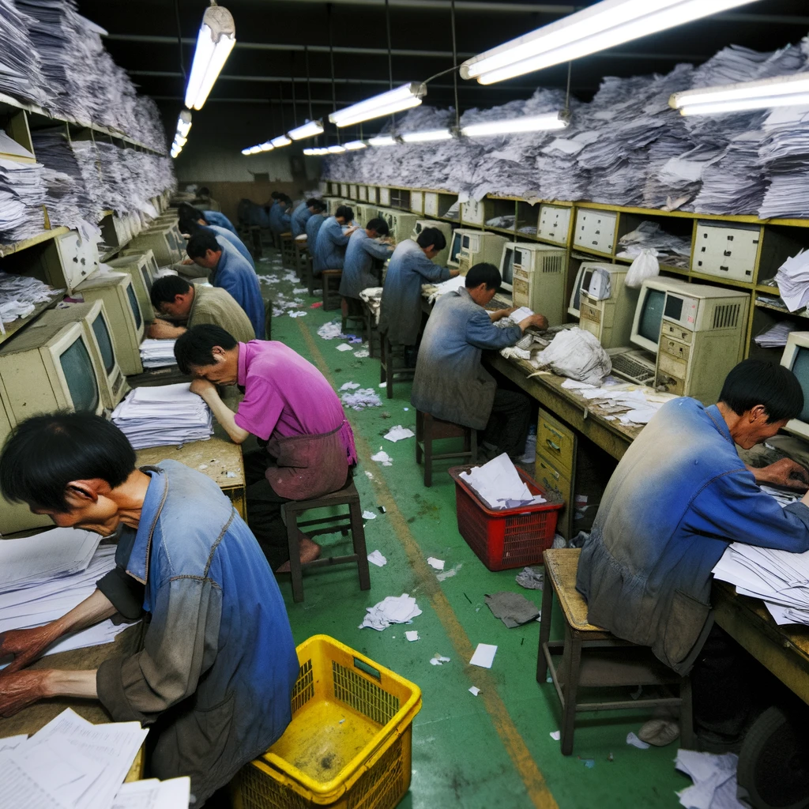

<p align="center" width="100%">
</p>

# KO-FINE-TUNING_DATAGEN 🐐

<p align="center" width="80%">

</p>

---
- 본 연구는 (주)마커와 (주)미디어그룹사람과숲의 오픈소스 LLM 연구 컨소시엄에서 진행되었습니다.

- 한국 오픈소스 커뮤니티의 번영과, 인공지능 분야의 발전을 기원합니다.

- 이 Repo는 `Self Supervised Learning` 매너로 Corpus에서 Fine-tuning Data를 생성하기 위한 repository 입니다.

- 한국 LLM 생태계의 경우, 고품질의 Fine-tuning 데이터셋이 매우 부족합니다.

- GPT4나 Gemini를 통해 데이터를 생성하여 활용할 수 있지만, 현재 각 라이센스에서 각 모델을 통해 생성된 데이터를 경쟁하는 모델 학습에 사용하는건 현재 라이센스 위반으로 나와 있습니다. 
  - 자세한 내용은 Open AI의 라이센스를 참고 바랍니다. (https://openai.com/policies/terms-of-use)

- 이를 해결하기 위해, 효율적인 방법론으로, 라이센스 Free한 데이터셋을 만들기 위한 방법론을 공유하고자 이렇게 깃허브 repo를 생성하게 되었습니다.

- 기존 허깅페이스 라이브러리에는, 저작권 논의가 이루어지고 있어 SSL 방법론을 적용하지 않는 데이터셋을 

- **`AI-Hub`의 말뭉치를 활용하여 데이터셋을 생성하는 방법론을 공유합니다.**

  - 사용 데이터 리스트는 다음과 같습니다.
    
    > 1. [일반상식 문장 생성 데이터](https://www.aihub.or.kr/aihubdata/data/view.do?currMenu=115&topMenu=100&aihubDataSe=data&dataSetSn=71309)
      
    > 2. [도서자료 요약](https://www.aihub.or.kr/aihubdata/data/view.do?currMenu=115&topMenu=100&aihubDataSe=data&dataSetSn=93)

    > 3. [논문자료 요약](https://www.aihub.or.kr/aihubdata/data/view.do?currMenu=115&topMenu=100&aihubDataSe=data&dataSetSn=90)

    > 4. [문서요약 텍스트](https://www.aihub.or.kr/aihubdata/data/view.do?currMenu=115&topMenu=100&aihubDataSe=data&dataSetSn=97) 


  - 위 4개의 데이터에 대해서 각각의 데이터를 생성하는 코드를 공유하도록 하겠습니다.


---
## Methodology 📕

- 1. Summary & Instruction-Answer 
    - 위 데이터는, 주어진 문장을 통해 적절한 제목을 생성하고, 내용을 요약하기 위한 데이터 입니다.

    - 모델이 주어진 정보 기반에서 맥락을 이해하고, 요청에 적절한 답을 수행하기 위한 목적에서 고안된 데이터 구성 방식입니다.

```python
<Instruction>
주어진 문장에 적절한 제목을 생성하고, 내용을 요약해주세요.

문장: 원고가 소속회사의 노동조합에서 분규가 발생하자 노조활동을 구실로 정상적인 근무를 해태하고, ...

<Answer>
제목: 부당노동행위구제재심판정취소
원고가  주동하여 회사업무능률을 저해하고 회사업무상의 지휘명령에 위반하였다면 이에 따른 징계해고는 사내질서를 유지하기 위한 사용자 고유의 정당한 징계권의 행사로 보아야 한다.
```

- 2. Sentence order inference
    - 위 데이터는, 주어진 문장 혹은 단어들을 활용하여 적절한 문장 생성을 위한 데이터 입니다.

    - 모델이 주어진 문장 혹은 단어를 통해, 적절한 문장을 생성하여 모델의 생성 능력을 향상시키기 위한 데이터셋 입니다.

```python
<Instruction>
임의의 순서로 나열된 문장들이 주어집니다. 주어진 문장들을 이용해 원본의 배열을 유추하고, 그 내용을 재구성하세요.

임의의 순서로 나열된 문장: ['나는', '천재다', '그러나', '바보다', '동시에']

<Answer>
나는 천재다. 그러나 동시에 바보다.
```

- 3. Original sentence inference
    - 위 데이터는, 주어진 요약물을 기반으로, 원본 문장을 생성하기 위해 고안된 데이터입니다.

    - 모델이 적절한 추론능력을 향상하게 하기 위해 고안한 데이터 입니다.

```python
<Instruction>
주어진 제목과 요약문에 대한 정보를 토대로, 요약되기 전 문장을 유추해서 생성해주세요.

제목: 수산물 수급 위기관리체계 구축을 위한 기초연구
요약문: 현대 사회에서 발생하는 다양하고...

<Answer>
지금의 국가가 직면하는 위기는 전통사회의 그것과 위기의 규모뿐만아니라...

```


- 4. Last sentence prediction
    - 위 데이터는, 주어진 문단의 마지막 문장을 생성하기 위한 목적을 가진 데이터 입니다.

    - 모델의 문맥 이해력 향상과, 적절한 생성능력을 향상시키기 위해 고안한 데이터입니다.

```python
<Instruction>
주어진 문장 뒤에 자연스럽게 이어질 문장을 생성해주세요.

문장: ...최근에 방문한 조선예술영화촬영소 에 있는 ‘문화성혁명사적관’(김정일관)에는 1960년대 중반부터 2000년대까지 40년 동안 김정일의 문화예술 부문 지도가 11,890건이며, 그 중 문화예술기관을 직접 방문하여 지도한 이른바 ‘현지지도’가 1,770건이라는 안내판이 있었다.

<Answer>
북한 연극이 김정일과 주체사상이라는 키워드를 떠나 존재할 수 없다는 것을 단적으로 말해 준다

```

- 5. Multi question
    - 위 데이터는, 주어지는 다양한 질문을 모델이 이해하고, 각 질문에 대해서 모델이 답하는 것을 목적으로 구성한 데이터 입니다.

    - 연속적인 질문에 대답하는 것은 매우 까다로운 task이며, 이를 고려하여 향후 RAG와 같은 시스템 내에서에서도 멀티턴 태스크에 대응 할 수 있도록 생성하였습니다. 

```python
<Instruction>
주어진 정보를 기반으로 질문에 답하세요. 답을 모른다면 답을 지어내지 말고 그냥 모른다고 말하세요.

1839년 바그너는 괴테의 파우스트을 처음 읽고 그 내용에 마음이...

질문:
1. 바그너는 괴테의 파우스트를 읽고 무엇을 쓰고자 했는가?
2. 바그너는 교향곡 작곡을 어디까지 쓴 뒤에 중단했는가?
3. 바그너가 파우스트 서곡을 쓸 때 어떤 곡의 영향을 받았는가?
4. 1839년 바그너가 교향곡의 소재로 쓰려고 했던 책은?
5. 파우스트 서곡의 라단조 조성이 영향을 받은 베토벤의 곡은?
6. 바그너가 파우스트를 처음으로 읽은 년도는?
7. 바그너가 처음 교향곡 작곡을 한 장소는?
8. 바그너의 1악장의 초연은 어디서 연주되었는가?

<Answer>
1. 교향곡
2. 1악장
3. 베토벤의 교향곡 9번
4. 파우스트
5. 합창교향곡
6. 1839
7. 파리
8. 드레스덴


```

- 6. Multi question
    - LLM 은 Transformer의 Decoder만을 활용하여 구성된 Auto-regressive 언어 생성 모델입니다.

    - Transformer Decoder에만 존재하는 Masked-Multi Head Attetntion 블록은, 모델이 미래의 정보를 참조하지 않고, 과거와 현재 state만을 활용하여 토큰을 생성하게 하는데, 이는 구조적으로 현재 LLM의 사전학습 방식인 CLM 방식을 적용하는 이유입니다.

    - 다만, 기존 Transforemer의 Encoder만을 활용한 BERT는 Bidirectional 하게 학습을 진행하기에 MLM 방식으로 사전학습을 진행하여 모델에서 언어의 이해를 증가 시킬 수 있도록 설계되었습니다.

    - 이러한 매커니즘에 인사이트를 얻어, 문장에 랜덤한 단어를 masking하고, 마스킹 한 단어를 예측하게 하여 모델에게 문맥의 이해와 추론 능력을 키우고자 하는 목적성에서 생성된 데이터입니다.

```python
<Instruction>
<Instruction>
주어진 문장에서 <MASK>에 들어갈 적절한 단어를 생성해주세요.

독도는 <MASK> 이다.

<Answer>
우리땅
```


# Acknowledgement

- (주)마커와 (주)미디어그룹사람과숲의 컨소시엄에서 학술적인 목적으로 연구되었으며, MIT License를 따릅니다. 

- 데이터 원천을 제공해 준 NIA와 AI-Hub에 감사의 인사를 드립니다.

- 한국의 LLM 생태계 발전에 힘써주신, 한국 오픈소스 개발자들과 연구원 분들에게 감사드립니다.

